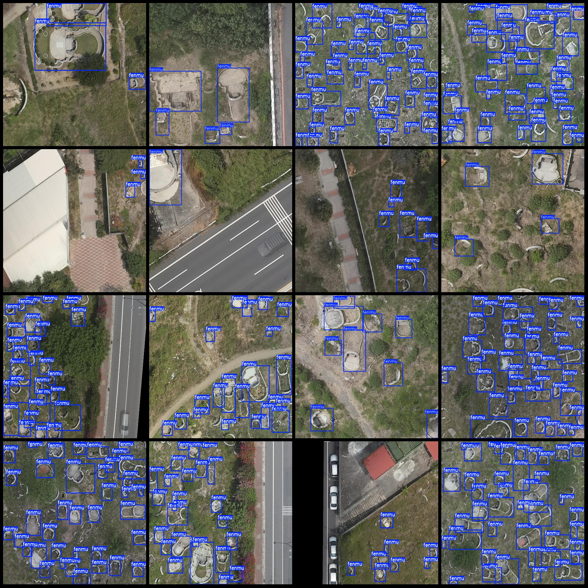
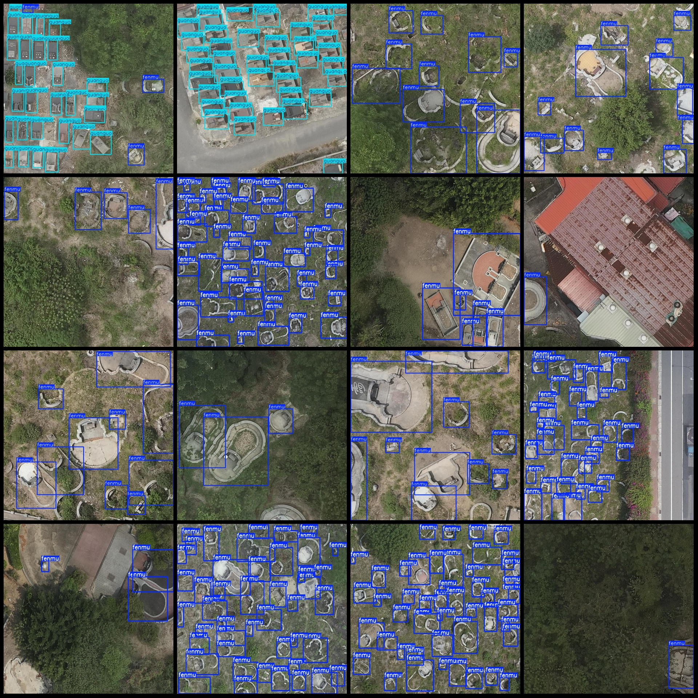

# Drone-Viewed Tomb and Coffin Detection Data Set (VOC+YOLO) - 237 Images in 2 Categories

The dataset format follows Pascal VOC format combined with YOLO format, without a separate split path for the txt file. It consists of only jpg images along with their corresponding VOC-formatted xml 
files and YOLO-formatted txt files.

Number of images (jpg file counts): 237
Number of annotations (xml file counts): 237
Number of annotations (txt file counts): 237
Number of annotation categories: 2
Annotation category names according to the yolo format (notice that the order of classes in the labels folder, "classes.txt", is different from this): ["fenmu", "guanguo"]

Each category has the following number of bounding boxes:
fenmu (tomb) = 3803
guanguo (coffin) = 508
Total bounding box count = 4311

Image resolutions include multiple resolutions such as 700x700, 964x849, etc.

Annotation tool used: labelImg
Drone used: DJI MAVIC 3
Collecting height: 20m
Collecting angle: 90°
Annotation rules: drawing rectangular boxes around categories

Important notes: The dataset does not have a split for training, validation, or testing; you will need to divide it yourself.
Special statement: This dataset does not guarantee the accuracy of the trained models or weight files.

Image previews:
Annotation examples:

## Image

Here is a pay link on Stripe ( https://buy.stripe.com/3cs8yP7sY87d0vu9AB ). Please contact me lonlonago@foxmail.com after funding $89, and I will send you a complete data files , thank you!

